<h1>Лабораторная работа 1</h1>    


<h2>Задание 1</h2>


<p>name=input('Имя:')<br>
age=int(input('Возраст:'))<br>
print(f'Привет, {name}! Через год тебе будет {age+1}.')</p>

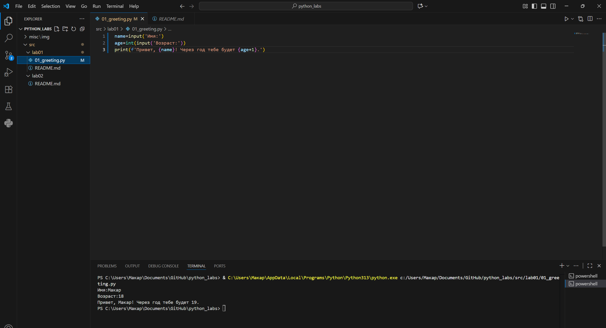


<h2>Задание 2</h2>

<p>a=float(input('a: ').replace(',','.'))<br>
b=float(input('b: ').replace(',','.'))<br>
sum=a+b<br>
avg=(a+b)/2<br>
print(f'sum={sum:.2f}; avg={avg:.2f}')</p>


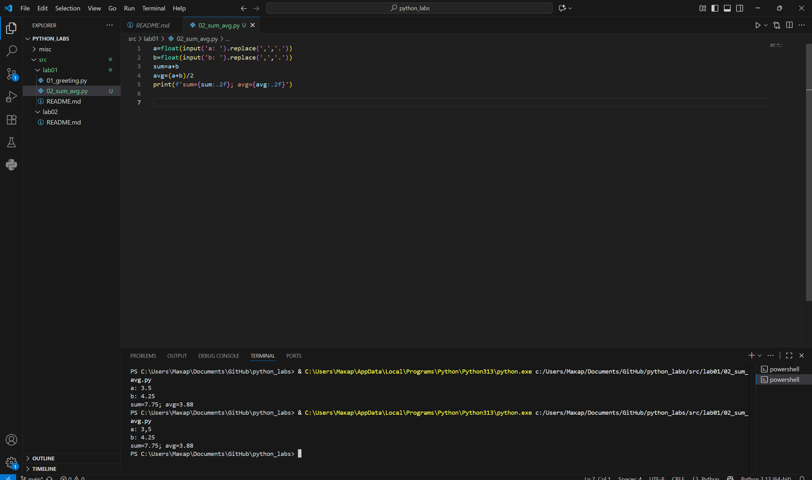


<h2>Задание 3</h2>


<p>price = float(input("price: "))<br>
discount = float(input("discount: "))<br>
vat = float(input("vat: "))<br>
base= price * (1-discount/100)<br>
vat_amount= base * (vat/100)<br>
total = base + vat_amount<br>
print(f'База после скидки: {base:.2f} ₽')<br>
print(f'НДС: {vat_amount:.2f} ₽')<br>
print(f'Итого к оплате: {total:.2f} ₽')</p>

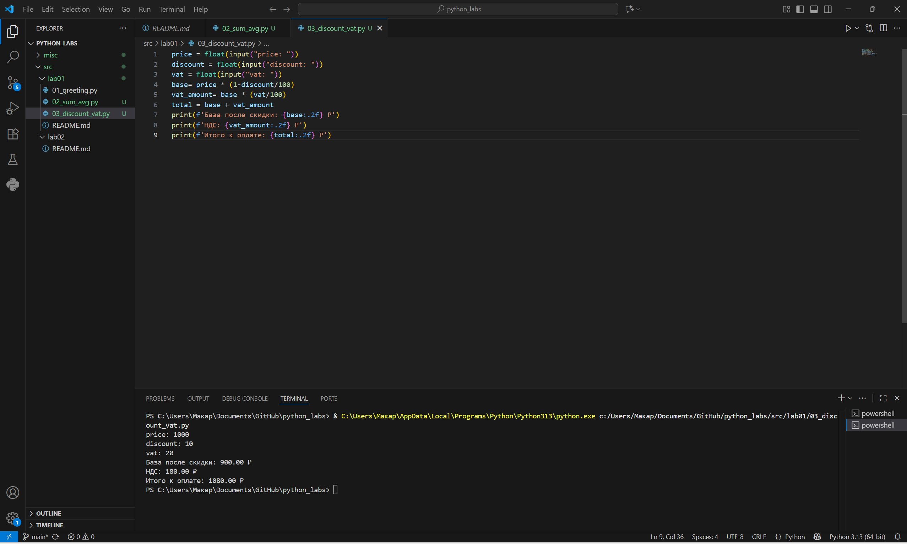


<h2>Задание 4</h2>


<p>m=int(input("Минуты: "))<br>
print(f'{m//60}:{m%60}')</p>

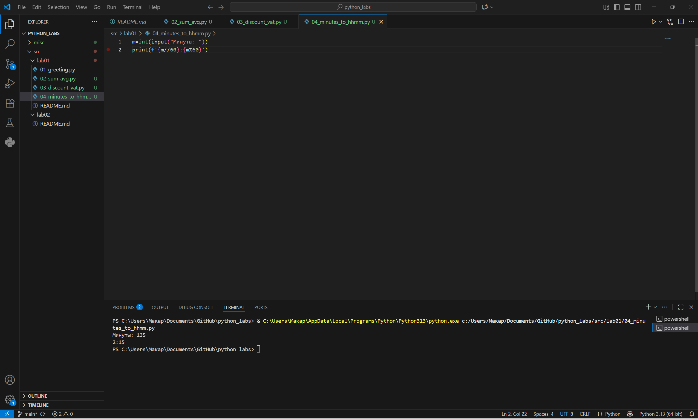


<h2>Задание 5</h2>


<p>name=input('ФИО: ')<br>
namecl=name.strip()<br>
words = namecl.split()<br>
init=[]<br>
for w in words:<br>
    fir = w[0]<br>
    up = fir.upper()<br>
    init.append(up)<br>
initre=''.join(init)<br>
lenth=sum(len(word) for word in words) + (len(words)-1)<br>
print(f'Инициалы: {initre}')<br>
print(f'Длина (символы): {lenth}')</p>


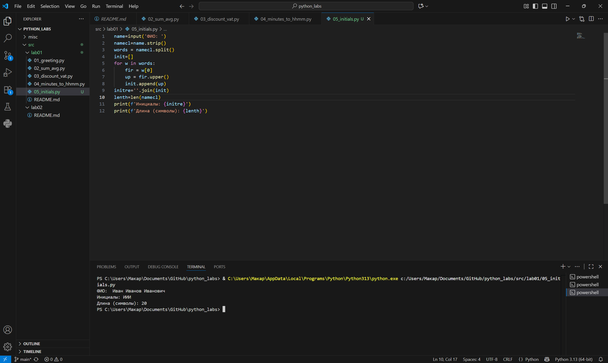


<h2>задание 6</h2>

```python
<p>n=int(input('in_1: '))<br>
och=0<br>
zaoch=0<br>
for i in range(n):<br>
    line = input(f'in_{i+2}: ').split()<br>
    format=line[-1]<br>
    if format == "True":<br>
        och+=1<br>
    else:<br>
        zaoch+=1<br>
print(f'out: {och} {zaoch}')</p>
```


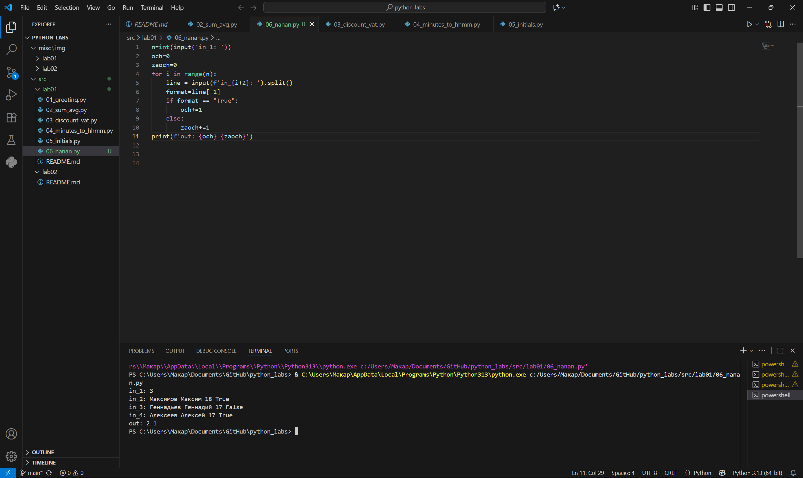


<h2>Задание 7</h2>

<p>s=input('in: ')<br>
def stroka(s):<br>
    start = next(i for i, c in enumerate(s) if c.isupper())<br>
    step = (next(i for i, c in enumerate(s) if c.isdigit()) + 1) - start<br>
    result = ""<br>
    for i in range(start, len(s), step):<br>
        result += s[i]<br>
        if s[i] == ".":<br>
            break<br>
    return result<br>


print(f'out: {stroka(s)}')</p>


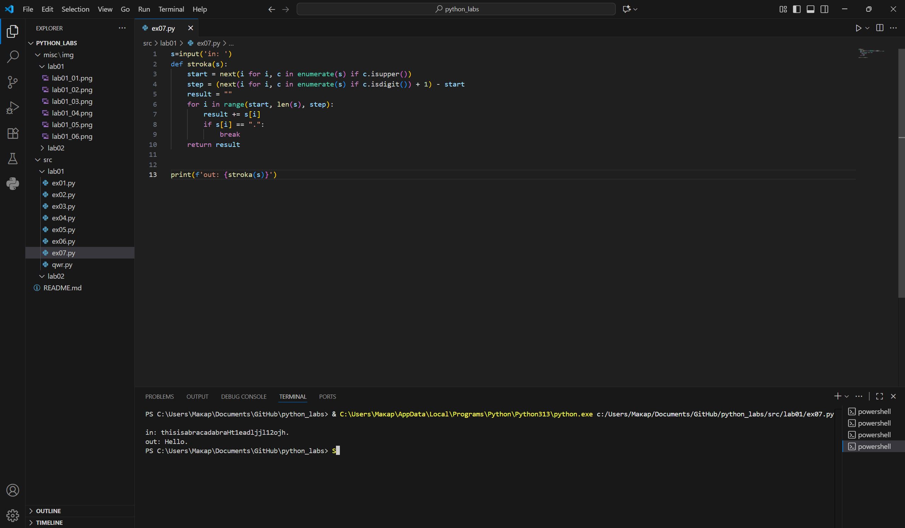


Лабораторная работа 2

Задание 1

```python
def min_max(nums: list[float | int]) -> tuple[float | int, float | int]:
    if not nums:
        raise ValueError
    return (min(nums),max(nums))


def unique_sorted(nums: list[float | int]) -> list[float | int]:
    a=set(nums)
    return sorted(a)


def flatten(mat: list[list | tuple]) -> list:
    res=[]
    for row in mat:
        if not isinstance(row, (list,tuple)):
           raise TypeError
        res.extend(row)     
    return res

print(min_max([3, -1, 5, 5, 0]))
print(min_max([42]))
print(min_max([-5, -2, -9]))
print(min_max([1.5, 2, 2.0, -3.1]))
print(min_max([]))

print(unique_sorted([3, 1, 2, 1, 3]))
print(unique_sorted([-1, -1, 0, 2, 2]))
print(unique_sorted([1.0, 1, 2.5, 2.5, 0]))
print(unique_sorted([]))


print(flatten([[1, 2], [3, 4]]))
print(flatten([[1, 2], (3, 4, 5)]))
print(flatten([[1], [], [2, 3]]))
print(flatten([[1, 2], "ab"]))
```
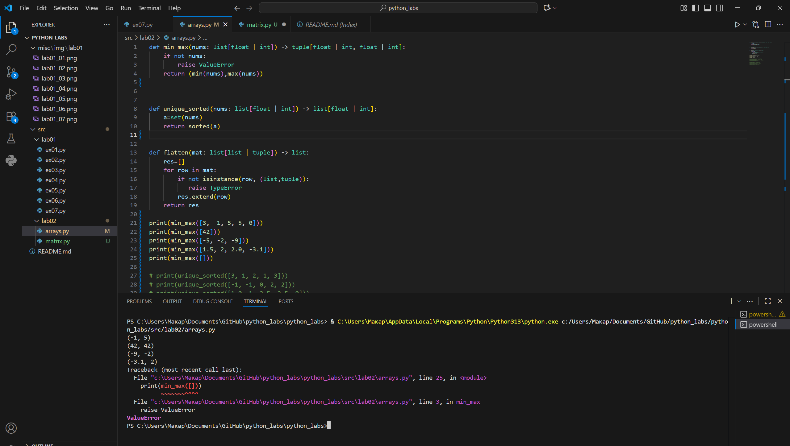
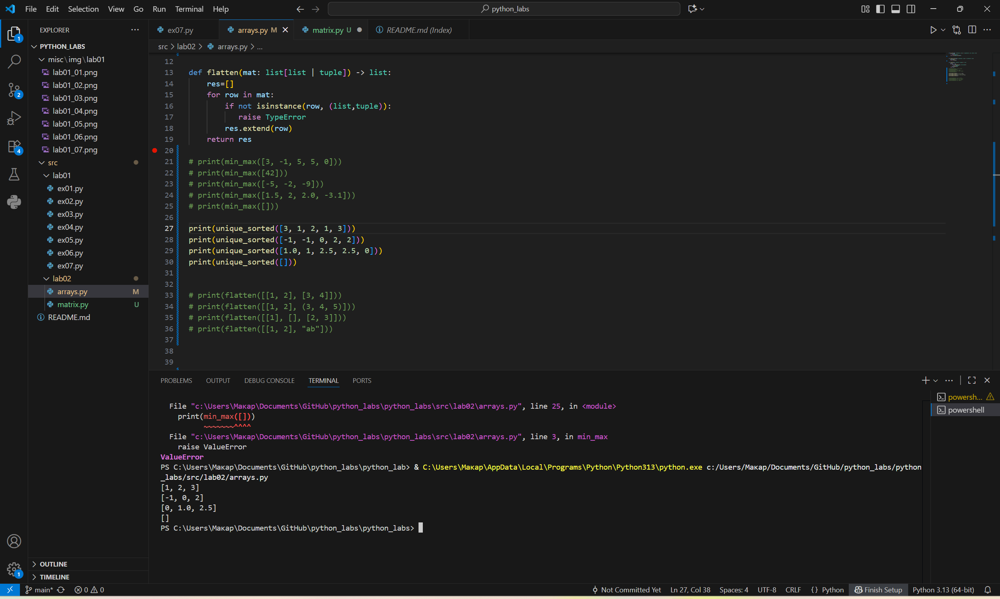
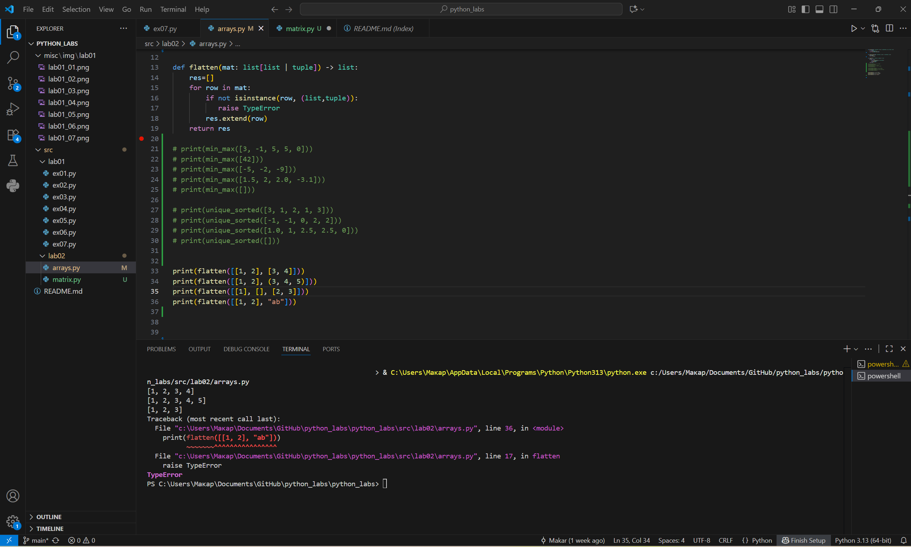


Задание B


```python
def check(mat: list[list])-> None:
    if not mat:
        return
    ln=len(mat[0])
    for i in mat:
        if len(i)!=ln:
            raise ValueError


def transpose(mat: list[list[float | int]]) -> list[list]:
    check(mat)
    if not mat:
        return []
    return[list(col) for col in zip(*mat)]


def row_sums(mat: list[list[float | int]]) -> list[float]:
    check(mat)
    return[sum(row) for row in mat]

def col_sums(mat: list[list[float | int]]) -> list[float]:
    check(mat)
    if not mat:
        return []
    return[sum(col) for col in zip(*mat)]
    
print(transpose([[1, 2, 3]]))     
print(transpose([[1], [2], [3]]))  
print(transpose([[1, 2], [3, 4]]))   
print(transpose([]))                
print(transpose([[1, 2], [3]]))          

print(row_sums([[1, 2, 3], [4, 5, 6]]))  
print(row_sums([[-1, 1], [10, -10]]))   
print(row_sums([[0, 0], [0, 0]]))    
print(row_sums([[1,2],[3]]))    

print(col_sums([[1, 2, 3], [4, 5, 6]]))  
print(col_sums([[-1, 1], [10, -10]]))  
print(col_sums([[0, 0], [0, 0]]))       
print(col_sums([[1, 2], [3]]))
```

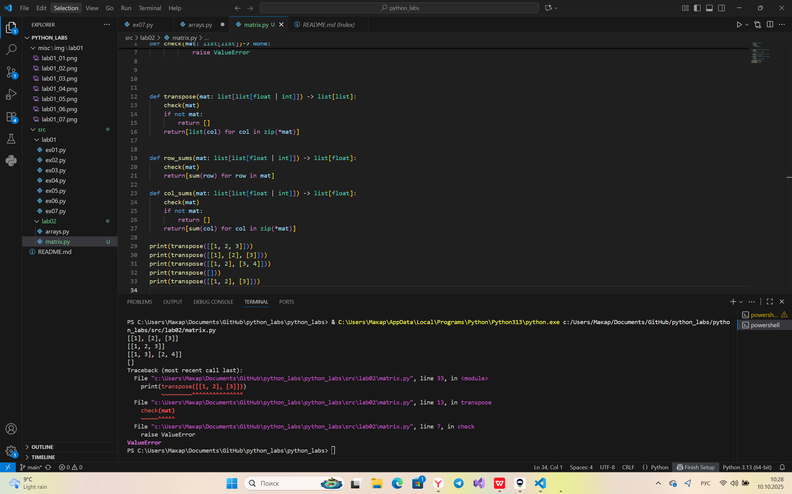
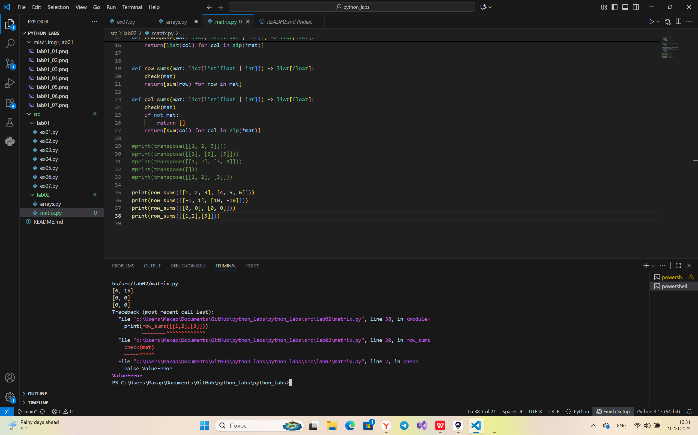
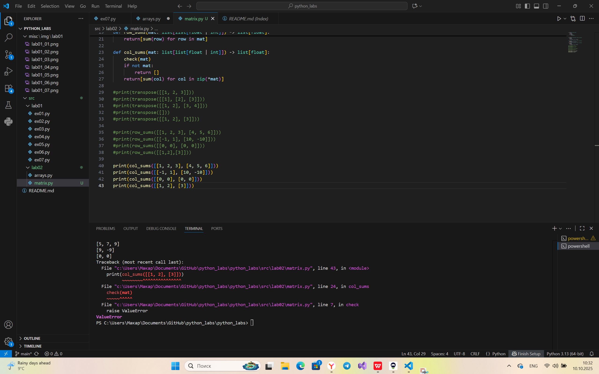


Задание C

```python
def format_record(rec: tuple[str, str, float]) -> str:
    if not isinstance(rec, tuple) or len(rec) != 3:
        raise ValueError("Ожидается кортеж из трёх элементов (fio, group, gpa)")

    fio, group, gpa = rec

    if not isinstance(fio, str):
        raise TypeError("ФИО должно быть строкой")
    
    if not isinstance(group, str):
        raise TypeError("Группа должна быть строкой")
    
    if not isinstance(gpa, (int, float)):
        raise TypeError("GPA должен быть числом")
    
    fio_clean=" ".join(fio.strip().split())

    parts=fio_clean.split()

    if len(parts)<2 or len(parts)>3:
        raise ValueError(f"Некорректное ФИО: '{fio}'")
    
    surname = parts[0].capitalize()

    initials= "".join(p[0].upper() + '.' for p in parts[1:])

    group_clean=group.strip()

    if not group_clean:
        raise ValueError("Группа не может быть пустой")
    
    gpa_str=f"{float(gpa):.2f}"

    return f"{surname} {initials}, гр. {group_clean}, GPA {gpa_str}"

print(format_record(("Иванов Иван Иванович", "BIVT-25", 4.6)))

print(format_record(("Петров Пётр", "IKBO-12", 5.0)))

print(format_record(("Петров Пётр Петрович", "IKBO-12", 5.0)))

print(format_record(("  сидорова  анна   сергеевна ", "ABB-01", 3.999)))
```
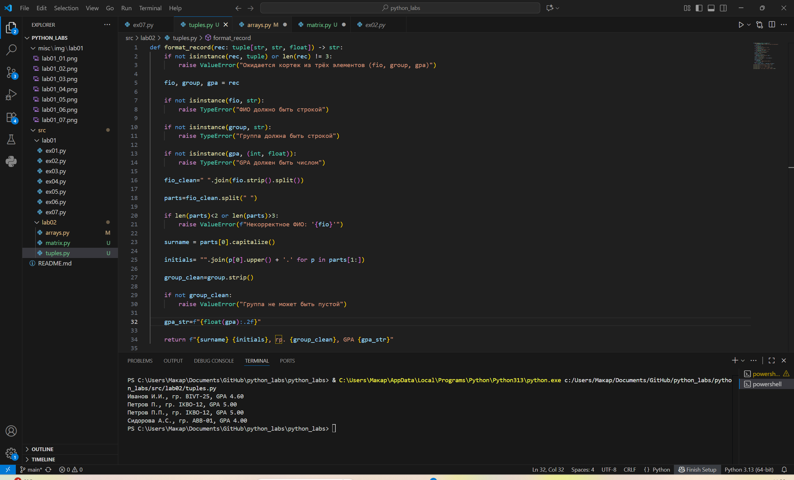


Лабараторная работа 3


Задание A
normalize
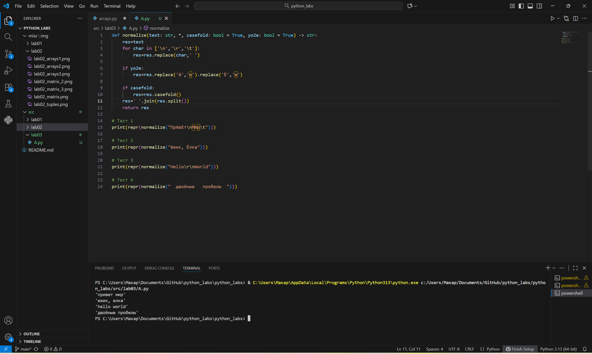
```python
def normalize(text: str, *, casefold: bool = True, yo2e: bool = True) -> str:
    res=text
    for char in ['\n','\r','\t']:
        res=res.replace(char,' ')
    
    if yo2e:
        res=res.replace('ё','е').replace('Ё','Е')
    
    if casefold:
        res=res.casefold()
    res=' '.join(res.split())


    return res

print(repr(normalize("ПрИвЕт\nМИр\t")))


print(repr(normalize("ёжик, Ёлка")))


print(repr(normalize("Hello\r\nWorld")))


print(repr(normalize("  двойные   пробелы  ")))
```

tokenize


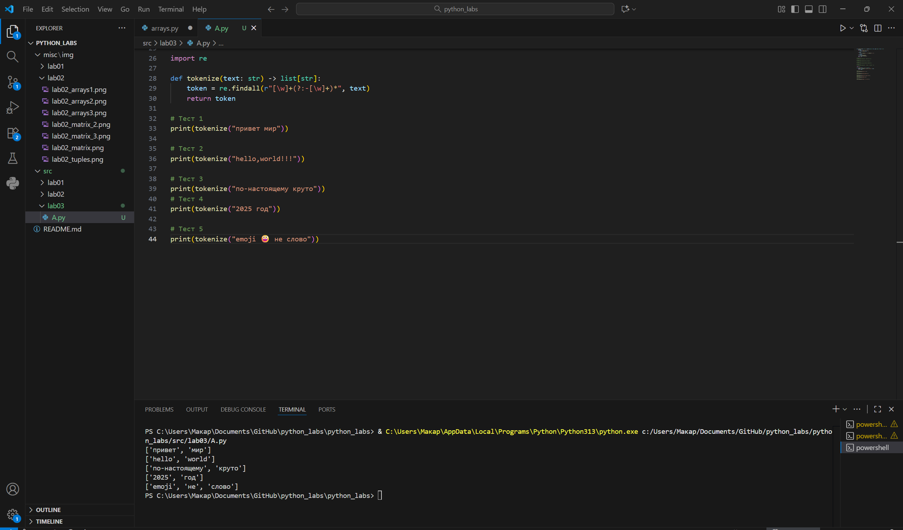


```python
import re

def tokenize(text: str) -> list[str]:
    token = re.findall(r"[\w]+(?:-[\w]+)*", text)
    return token

print(tokenize("привет мир"))

 
print(tokenize("hello,world!!!"))

print(tokenize("по-настоящему круто"))

print(tokenize("2025 год"))

print(tokenize("emoji 😀 не слово"))
```


count_freq 
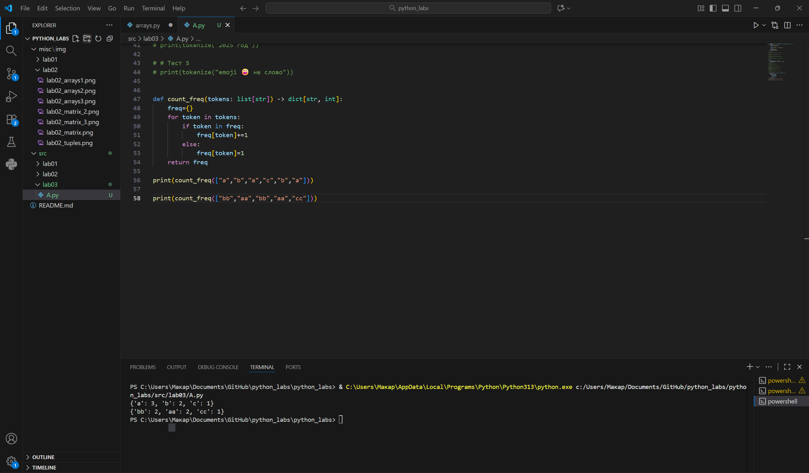

```python
def count_freq(tokens: list[str]) -> dict[str, int]:
    freq={}
    for token in tokens:
        if token in freq:
            freq[token]+=1
        else:
            freq[token]=1
    return freq

print(count_freq(["a","b","a","c","b","a"]))

print(count_freq(["bb","aa","bb","aa","cc"]))


```

top_n


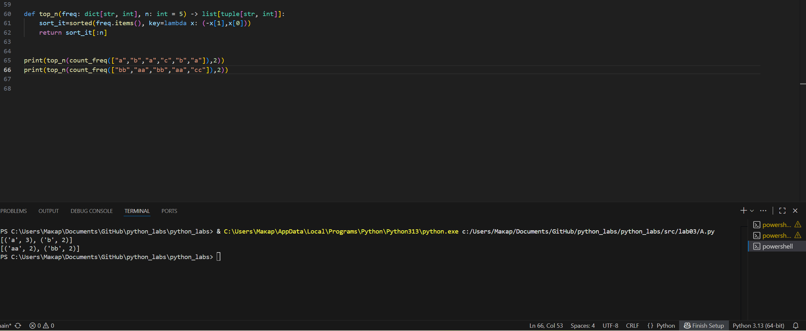


```python
def top_n(freq: dict[str, int], n: int = 5) -> list[tuple[str, int]]:
    sort_it=sorted(freq.items(), key=lambda x: (-x[1],x[0]))
    return sort_it[:n]


print(top_n(count_freq(["a","b","a","c","b","a"]),2))
print(top_n(count_freq(["bb","aa","bb","aa","cc"]),2))

```


Mini test

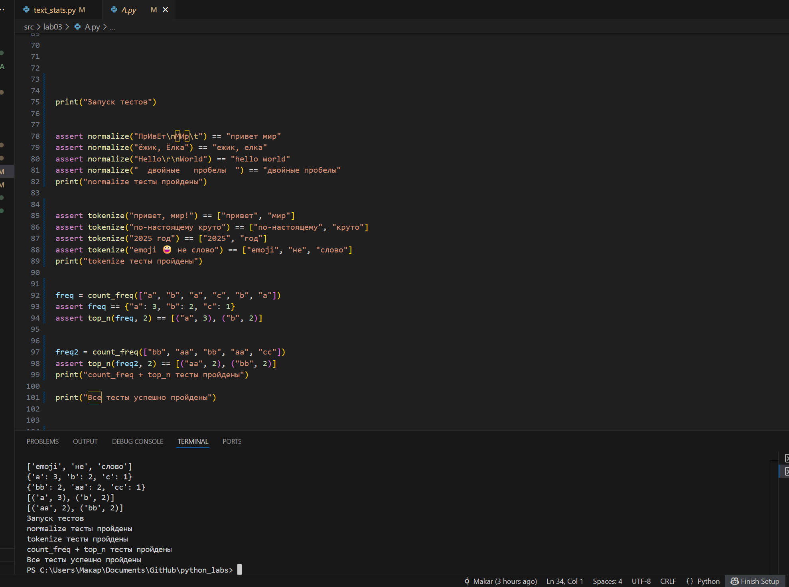

```python
print("Запуск тестов...")
    
        # Тесты normalize
assert normalize("ПрИвЕт\nМИр\t") == "привет мир"
assert normalize("ёжик, Ёлка") == "ежик, елка"
assert normalize("Hello\r\nWorld") == "hello world"
assert normalize("  двойные   пробелы  ") == "двойные пробелы"
print("✓ normalize тесты пройдены")
    
    # Тесты tokenize
assert tokenize("привет, мир!") == ["привет", "мир"]
assert tokenize("по-настоящему круто") == ["по-настоящему", "круто"]
assert tokenize("2025 год") == ["2025", "год"]
assert tokenize("emoji 😀 не слово") == ["emoji", "не", "слово"]
print("✓ tokenize тесты пройдены")
    
    # Тесты count_freq + top_n
freq = count_freq(["a", "b", "a", "c", "b", "a"])
assert freq == {"a": 3, "b": 2, "c": 1}
assert top_n(freq, 2) == [("a", 3), ("b", 2)]
    
    # Тай-брейк по слову при равной частоте
freq2 = count_freq(["bb", "aa", "bb", "aa", "cc"])
assert top_n(freq2, 2) == [("aa", 2), ("bb", 2)]
print("✓ count_freq + top_n тесты пройдены")

print("Все тесты успешно пройдены")

```


Задание B


```python
import sys
from  text import *
from pathlib import Path

sys.path.append(str(Path(__file__).resolve().parents[1]))

def main():
    text =sys.stdin.read() 

    if not text:
        print("Ввод пуст")
        return
    
    
    normalized_text = normalize(text)
    tokens = tokenize(normalized_text)
    freq_dict = count_freq(tokens)
    
    total_words = len(tokens)
    unique_words = len(freq_dict)
    
   
    print(f"Всего слов: {total_words}")
    print(f"Уникальных слов: {unique_words}")
    
 
    print("Топ-5:")
    top_words = top_n(freq_dict, 5)
    for word, count in top_words:
        print(f"{word}:{count}")
 
if __name__ == "__main__":
    main()
```


<h1>Лабораторная Работа 4</h1>

<h2>Задание A</h2>

```python
from pathlib import Path
import csv


def read_text(path: str | Path, encoding: str = "utf-8") -> str:
    p=Path(path)
    return p.read_text(encoding=encoding)

def write_csv(rows: list[tuple | list], path: str | Path, header: tuple[str, ...] | None = None) -> None:
    p = Path(path)
    rows_list = list(rows)

    if rows_list:
        first_len = len(rows_list[0])
        for i, row in enumerate(rows_list):
            if len(row) != first_len:
                raise ValueError(f"Строка {i} имеет длину {len(row)}, ожидается {first_len}")
            
    with open(path, "w", newline="", encoding="utf-8") as f:
        writer = csv.writer(f)
        if header is not None:
            writer.writerow(header)
        writer.writerows(rows_list)
```


<h2>Mini test</h2>


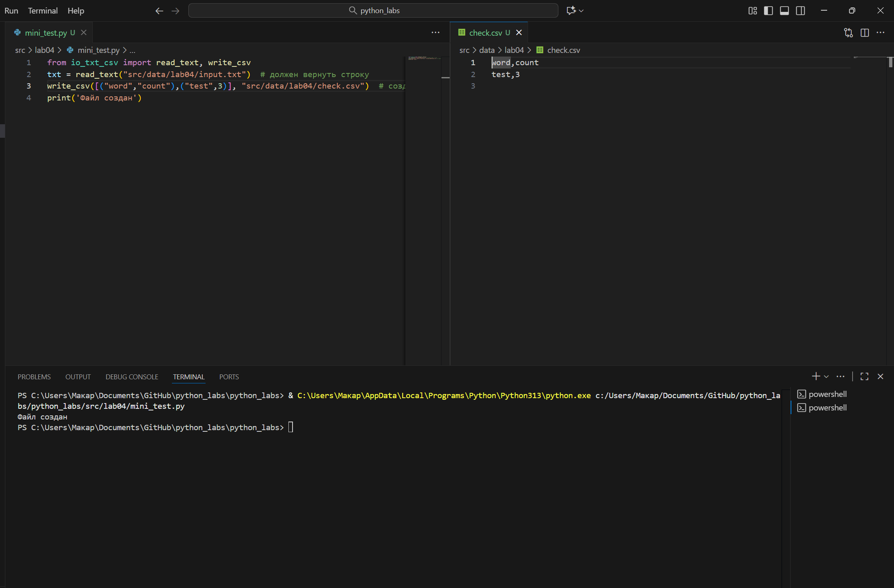


<h2>Задание B</h2>


```python
import sys
import argparse
from pathlib import Path
from collections import Counter

# Добавляем путь к модулям для импорта из lib
sys.path.insert(0, str(Path(__file__).parent.parent))

from io_txt_csv import read_text, write_csv


def frequencies_from_text(text: str) -> dict[str, int]:
    from lib.text import normalize, tokenize
    
    tokens = tokenize(normalize(text))
    return Counter(tokens)


def main():
    """Основная функция скрипта."""
    parser = argparse.ArgumentParser(description='Анализ частоты слов в тексте')
    parser.add_argument('--input', '-i', default='src/data/lab04/input.txt',
                       help='Входной файл (по умолчанию: src/data/lab04/input.txt)')
    parser.add_argument('--output', '-o', default='src/data/lab04/report.csv',
                       help='Выходной файл (по умолчанию: src/data/lab04/report.csv)')
    parser.add_argument('--encoding', '-e', default='utf-8',
                       help='Кодировка файла (по умолчанию: utf-8)')
    
    args = parser.parse_args()
    
    try:
        # Чтение и анализ текста с указанной кодировкой
        text = read_text(args.input, encoding=args.encoding)
        freq = frequencies_from_text(text)
        from lib.text import top_n
        sorted_freq = top_n(freq, len(freq))  # Получаем все слова отсортированными
        
        # Подсчет статистики
        total_words = sum(freq.values())
        unique_words = len(freq)
        
        # Запись в CSV
        write_csv(sorted_freq, args.output, header=("word", "count"))
        
        # Вывод статистики в консоль
        print(f"Входной файл: {args.input}")
        print(f"Кодировка: {args.encoding}")
        print(f"Всего слов: {total_words}")
        print(f"Уникальных слов: {unique_words}")
        print("Топ-5:")
        
        # Вывод топ-5 слов
        top_5 = sorted_freq[:5]
        for word, count in top_5:
            print(f"{word}:{count}")
            
        print(f"\nОтчет сохранен в: {args.output}")
        
    except FileNotFoundError:
        print(f"Ошибка: Файл '{args.input}' не найден")
        print("Убедитесь, что файл существует")
        sys.exit(1)
    except UnicodeDecodeError as e:
        print(f"Ошибка декодирования: {e}")
        print(f"Попробуйте указать правильную кодировку: --encoding cp1251")
        sys.exit(1)


if __name__ == "__main__":
    main()
```

<h1>Тест кейс</h1>
<h2>A</h2>

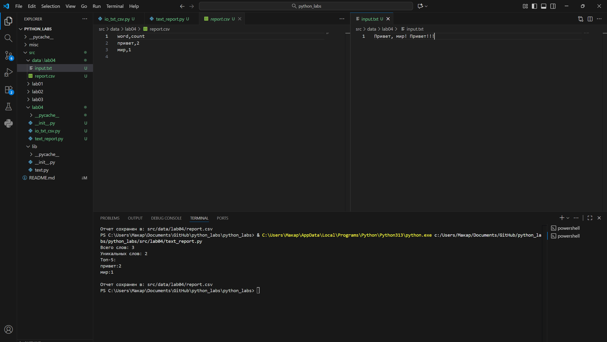

<h2>B</h2>


<h2>C</h2>

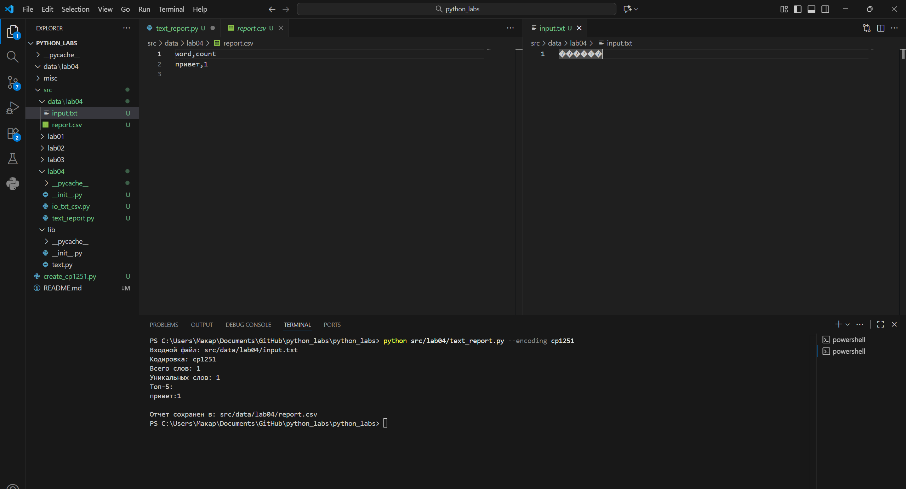


<h1>Лабораторная Работа 6</h1>

<h2>Задание 1</h2>


```python
from src.lib.text import *

import argparse

from pathlib import Path
import sys

def ensure_file_exists(path: Path, parser):
    if not path.exists():
        parser.error(f"Ошибка: входной файл не найден: {path}")
    if not path.is_file():
        parser.error(f"Ошибка: путь не является файлом: {path}")

def command_cat(path: Path, numbered: bool, parser):
    ensure_file_exists(path, parser)
    try:
        with path.open('r', encoding='utf-8') as f:
            for i, line in enumerate(f, start=1):
                if numbered:
                    print(f"{i:4d} | {line.rstrip()}")
                else:
                    print(line.rstrip())
    except Exception as e:
        parser.error(f"Ошибка при чтении файла: {e}")


def command_stats(path: Path, top: int, parser):
    ensure_file_exists(path, parser)
    try:
        text = path.read_text(encoding="utf-8")
    except Exception as e:
        parser.error(f"Ошибка при чтении файла: {e}")
    
    try:
        norm = normalize(text)
        tokens = tokenize(norm)
        freq = count_freq(tokens)
        words = top_n(freq, top)

        for words, freq in words:
           print(f"{words:15s} {freq}")

    except Exception as e:
        parser.error(f"Ошибка при чтении файла: {e}")

def main():
    parser=argparse.ArgumentParser(description='CLI‑утилиты лабораторной №6')
    subparsers = parser.add_subparsers(dest='command')

    cat_parser= subparsers.add_parser('cat', help='Вывести содержимое файла')
    cat_parser.add_argument('--input', required=True)
    cat_parser.add_argument('-n', action='store_true', help='Нумеровать строки')

    stats_parser=subparsers.add_parser('stats', help='Частоты слов')
    stats_parser.add_argument("--input", required=True)
    stats_parser.add_argument("--top", type=int, default=5)

    args = parser.parse_args()

    if args.command == 'cat':
        command_cat(Path(args.input), args.n, parser)
    elif args.command == "stats":
        command_stats(Path(args.input), args.top, parser)
    else:
        parser.error("Ошибка: команда не указана. Посмотрите помощь через --help.")


if __name__ == "__main__":
    main()
```

<h3>Подкоманда cat</h3>

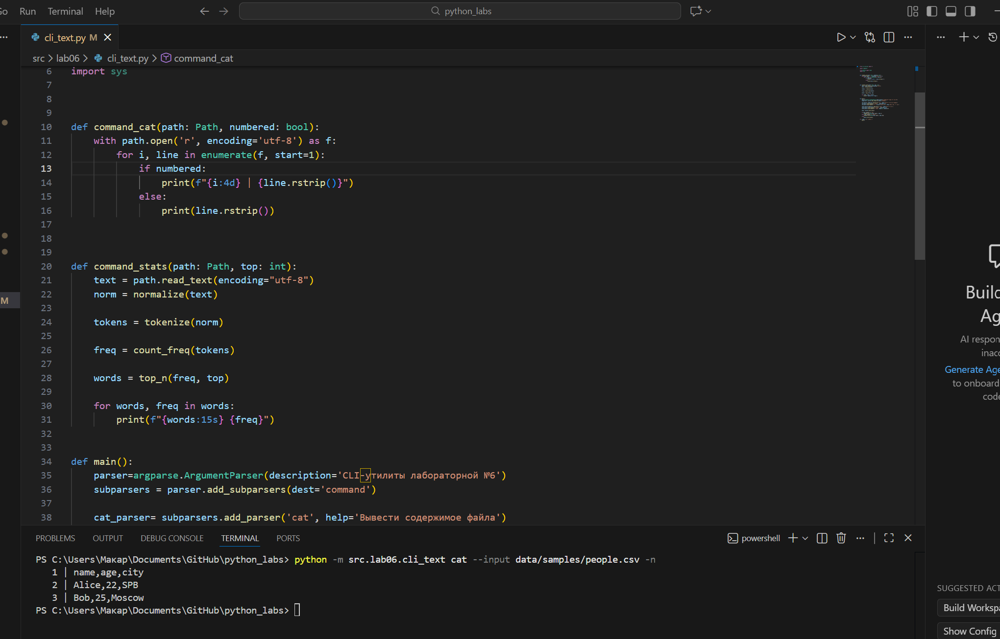

<h3>Подкоманда stats</h3>

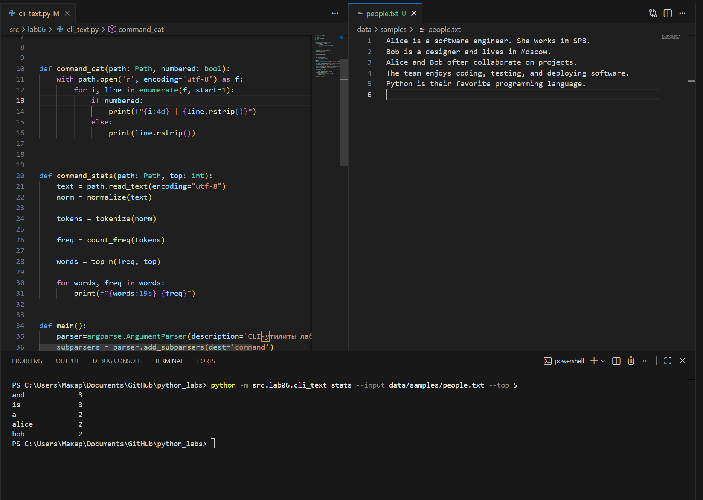

<h2>Задание 2</h2>

```python
import argparse
from src.lib.json_csv import json_to_csv, csv_to_json
from src.lib.csv_xlsx import csv_to_xlsx
from pathlib import Path

def ensure_file_exists(path: Path, parser):
    if not path.exists():
        parser.error(f"Ошибка: входной файл не найден: {path}")
    if not path.is_file():
        parser.error(f"Ошибка: путь не является файлом: {path}")

def command_json_to_csv(inp: Path, out: Path, parser):
    ensure_file_exists(inp, parser)
    try:
        json_to_csv(inp, out)
        print(f"CSV сохранён в: {out}")
    except Exception as e:
        parser.error(f"Ошибка конвертации JSON → CSV: {e}")

def command_csv_to_json(inp: Path, out: Path, parser):
    ensure_file_exists(inp, parser)
    try:
        csv_to_json(inp, out)
        print(f"JSON сохранён в: {out}")
    except Exception as e:
        parser.error(f"Ошибка конвертации CSV → JSON: {e}")

def command_csv_to_xlsx(inp: Path, out: Path, parser):
    ensure_file_exists(inp, parser)
    try:
        csv_to_xlsx(inp, out)
        print(f"XLSX сохранён в: {out}")
    except Exception as e:
        parser.error(f"Ошибка конвертации CSV → XLSX: {e}")

def main():
    parser = argparse.ArgumentParser(description="Конвертеры данных")
    sub = parser.add_subparsers(dest="cmd")

    p1 = sub.add_parser("json2csv")
    p1.add_argument("--in", dest="input", required=True)
    p1.add_argument("--out", dest="output", required=True)

    p2 = sub.add_parser("csv2json")
    p2.add_argument("--in", dest="input", required=True)
    p2.add_argument("--out", dest="output", required=True)

    p3 = sub.add_parser("csv2xlsx")
    p3.add_argument("--in", dest="input", required=True)
    p3.add_argument("--out", dest="output", required=True)

    args = parser.parse_args()

    inp = Path(args.input)
    out = Path(args.output)

    if args.cmd == "json2csv":
        command_json_to_csv(inp, out, parser)

    elif args.cmd == "csv2json":
        command_csv_to_json(inp, out, parser)

    elif args.cmd == "csv2xlsx":
        command_csv_to_xlsx(inp, out, parser)

    else:
        parser.error("Ошибка: команда не указана. Используйте --help.")

if __name__ == "__main__":
    main()
```
<h3>Подкоманда csv2json</h3>

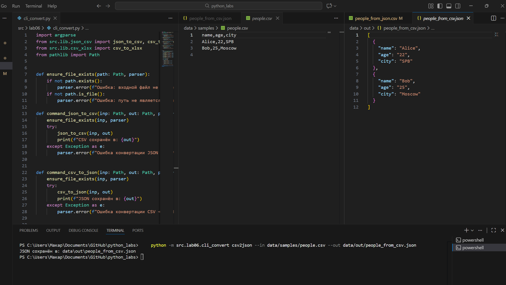

<h3>Подкоманда json2csv</h3>

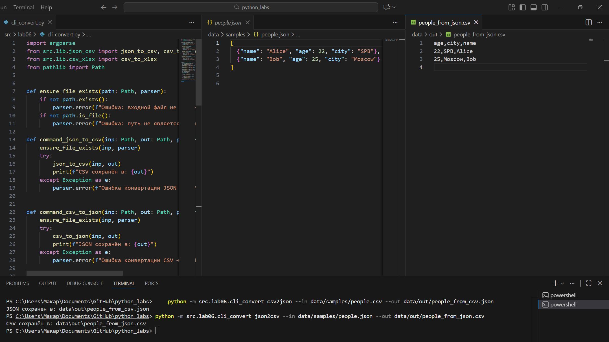

<h3>Подкоманда csv2xlsx</h3>

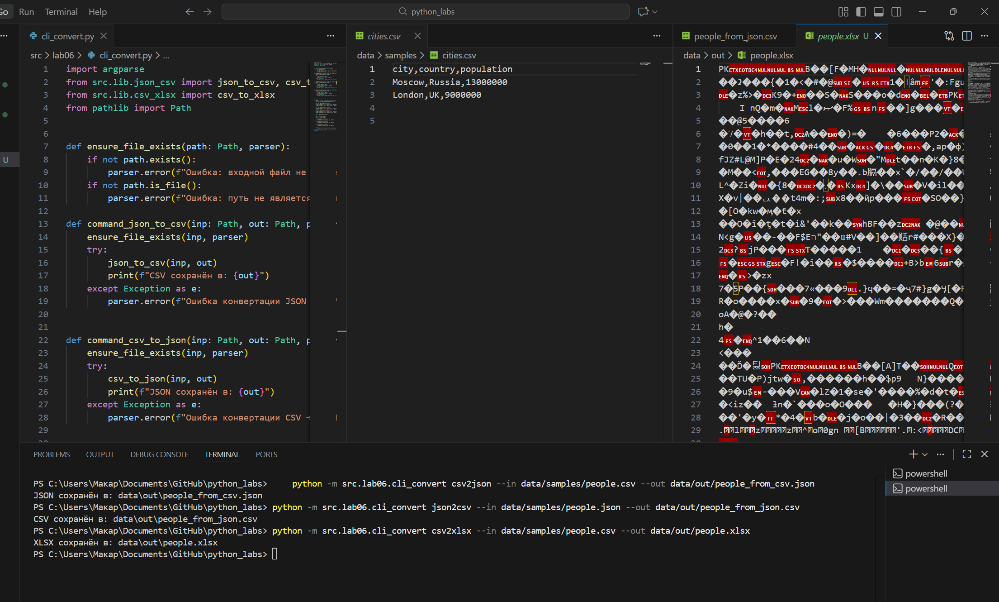


<h3>Help cli_text</h3>

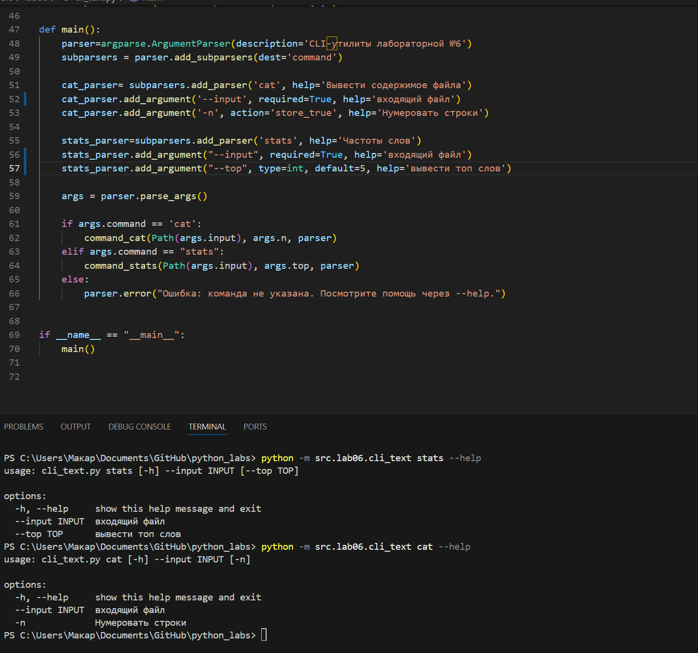

<h3>Help cli_convert</h3>

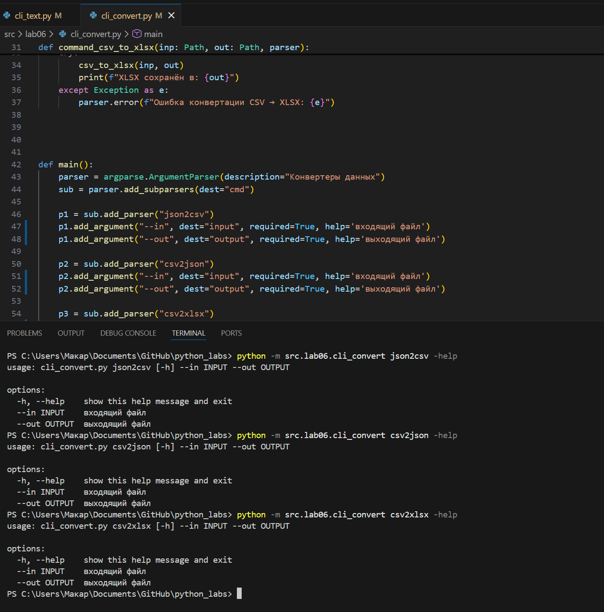
