Лабораторная работа 1


Задание 1


<p>name=input('Имя:')<br>
age=int(input('Возраст:'))<br>
print(f'Привет, {name}! Через год тебе будет {age+1}.')</p>


Задание 2

<p>a=float(input('a: ').replace(',','.'))<br>
b=float(input('b: ').replace(',','.'))<br>
sum=a+b<br>
avg=(a+b)/2<br>
print(f'sum={sum:.2f}; avg={avg:.2f}')</p>


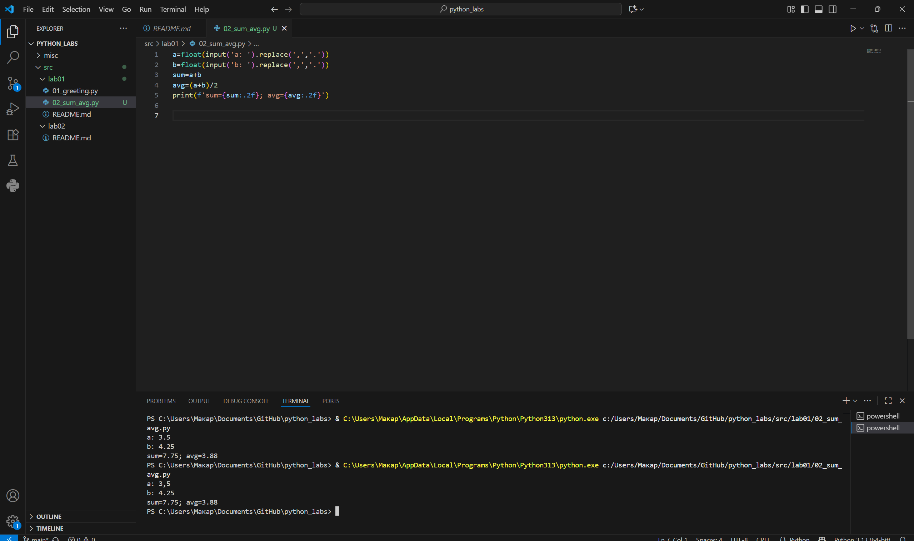


Задание 3


<p>price = float(input("price: "))<br>
discount = float(input("discount: "))<br>
vat = float(input("vat: "))<br>
base= price * (1-discount/100)<br>
vat_amount= base * (vat/100)<br>
total = base + vat_amount<br>
print(f'База после скидки: {base:.2f} ₽')<br>
print(f'НДС: {vat_amount:.2f} ₽')<br>
print(f'Итого к оплате: {total:.2f} ₽')</p>

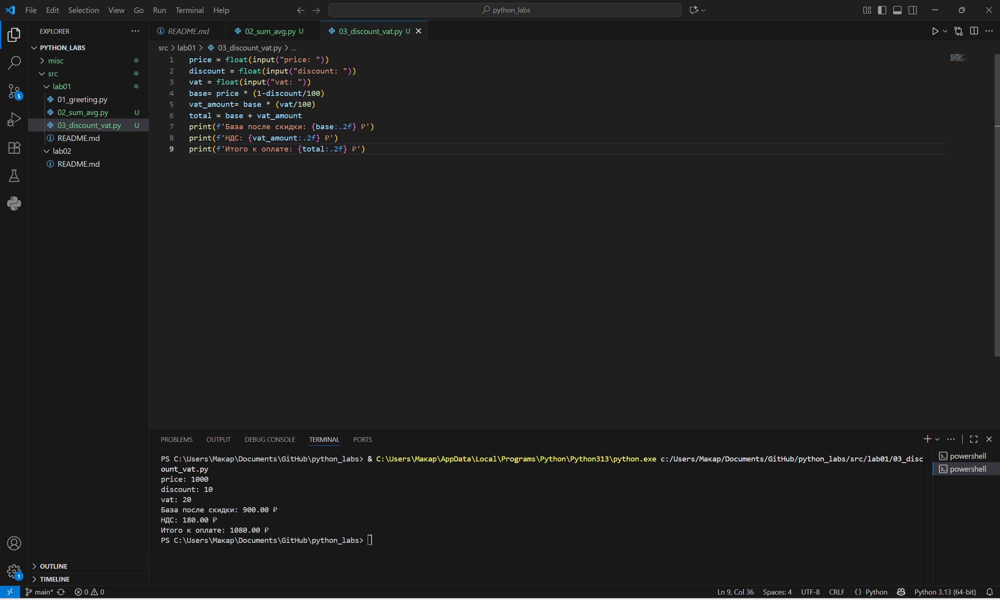


Задание 4


<p>m=int(input("Минуты: "))<br>
print(f'{m//60}:{m%60}')</p>

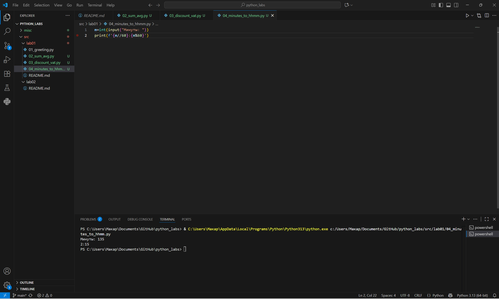


Задание 5


<p>name=input('ФИО: ')<br>
namecl=name.strip()<br>
words = namecl.split()<br>
init=[]<br>
for w in words:<br>
    fir = w[0]<br>
    up = fir.upper()<br>
    init.append(up)<br>
initre=''.join(init)<br>
lenth=sum(len(word) for word in words) + (len(words)-1)<br>
print(f'Инициалы: {initre}')<br>
print(f'Длина (символы): {lenth}')</p>


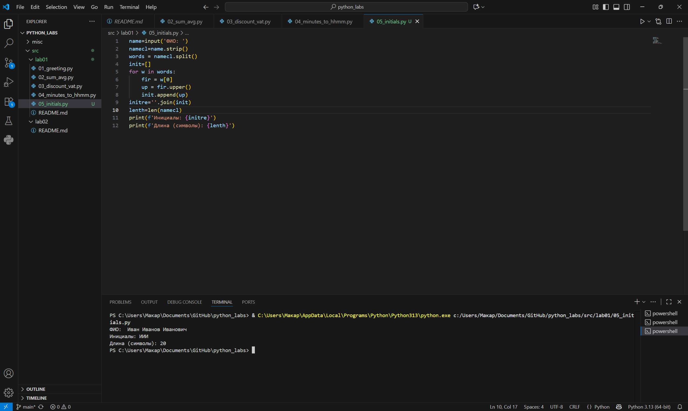


задание 6

```python
<p>n=int(input('in_1: '))<br>
och=0<br>
zaoch=0<br>
for i in range(n):<br>
    line = input(f'in_{i+2}: ').split()<br>
    format=line[-1]<br>
    if format == "True":<br>
        och+=1<br>
    else:<br>
        zaoch+=1<br>
print(f'out: {och} {zaoch}')</p>
```


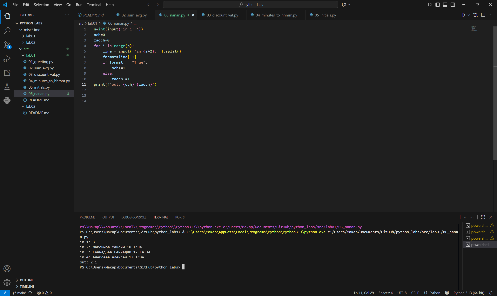


Задание 7

<p>s=input('in: ')<br>
def stroka(s):<br>
    start = next(i for i, c in enumerate(s) if c.isupper())<br>
    step = (next(i for i, c in enumerate(s) if c.isdigit()) + 1) - start<br>
    result = ""<br>
    for i in range(start, len(s), step):<br>
        result += s[i]<br>
        if s[i] == ".":<br>
            break<br>
    return result<br>


print(f'out: {stroka(s)}')</p>


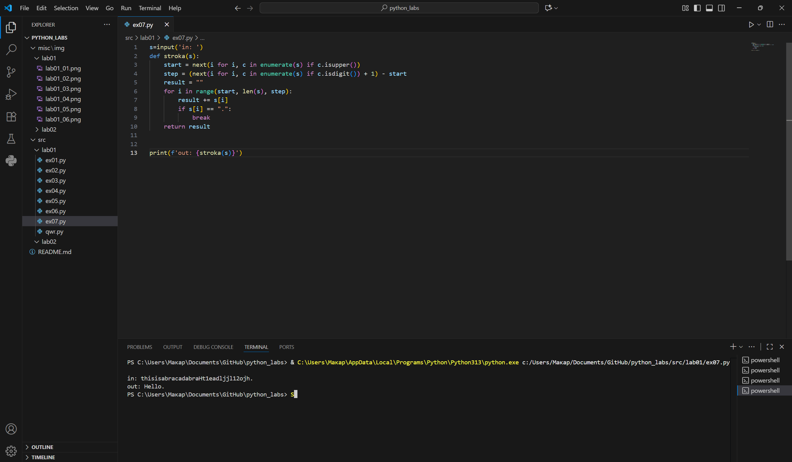


Лабораторная работа 2

Задание 1

```python
def min_max(nums: list[float | int]) -> tuple[float | int, float | int]:
    if not nums:
        raise ValueError
    return (min(nums),max(nums))


def unique_sorted(nums: list[float | int]) -> list[float | int]:
    a=set(nums)
    return sorted(a)


def flatten(mat: list[list | tuple]) -> list:
    res=[]
    for row in mat:
        if not isinstance(row, (list,tuple)):
           raise TypeError
        res.extend(row)     
    return res

print(min_max([3, -1, 5, 5, 0]))
print(min_max([42]))
print(min_max([-5, -2, -9]))
print(min_max([1.5, 2, 2.0, -3.1]))
print(min_max([]))

print(unique_sorted([3, 1, 2, 1, 3]))
print(unique_sorted([-1, -1, 0, 2, 2]))
print(unique_sorted([1.0, 1, 2.5, 2.5, 0]))
print(unique_sorted([]))


print(flatten([[1, 2], [3, 4]]))
print(flatten([[1, 2], (3, 4, 5)]))
print(flatten([[1], [], [2, 3]]))
print(flatten([[1, 2], "ab"]))
```
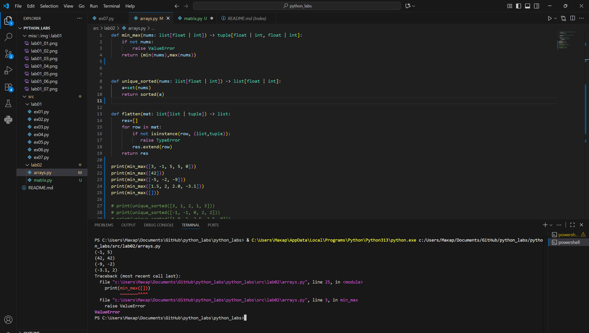
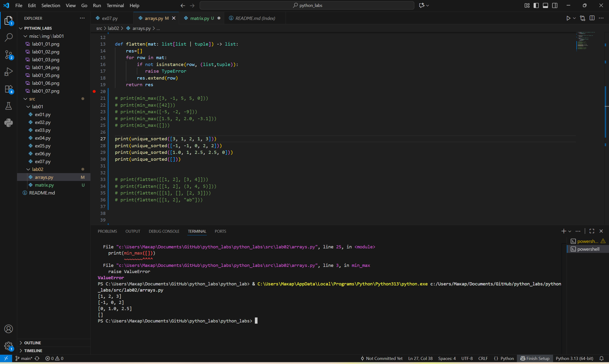
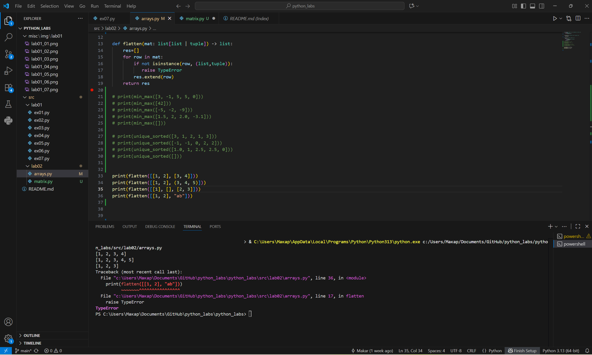


Задание B


```python
def check(mat: list[list])-> None:
    if not mat:
        return
    ln=len(mat[0])
    for i in mat:
        if len(i)!=ln:
            raise ValueError


def transpose(mat: list[list[float | int]]) -> list[list]:
    check(mat)
    if not mat:
        return []
    return[list(col) for col in zip(*mat)]


def row_sums(mat: list[list[float | int]]) -> list[float]:
    check(mat)
    return[sum(row) for row in mat]

def col_sums(mat: list[list[float | int]]) -> list[float]:
    check(mat)
    if not mat:
        return []
    return[sum(col) for col in zip(*mat)]
    
print(transpose([[1, 2, 3]]))     
print(transpose([[1], [2], [3]]))  
print(transpose([[1, 2], [3, 4]]))   
print(transpose([]))                
print(transpose([[1, 2], [3]]))          

print(row_sums([[1, 2, 3], [4, 5, 6]]))  
print(row_sums([[-1, 1], [10, -10]]))   
print(row_sums([[0, 0], [0, 0]]))    
print(row_sums([[1,2],[3]]))    

print(col_sums([[1, 2, 3], [4, 5, 6]]))  
print(col_sums([[-1, 1], [10, -10]]))  
print(col_sums([[0, 0], [0, 0]]))       
print(col_sums([[1, 2], [3]]))
```

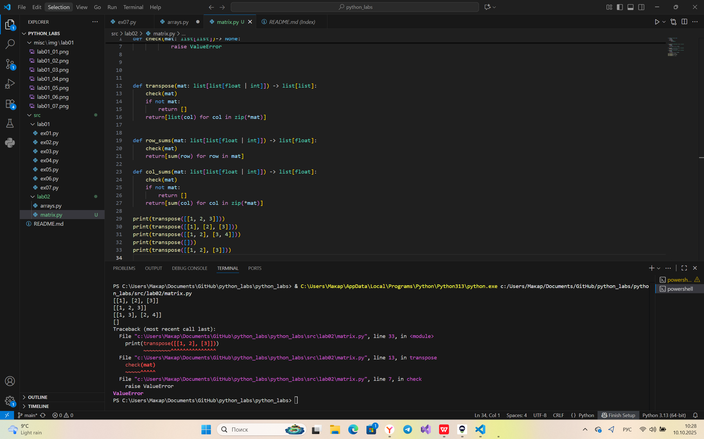
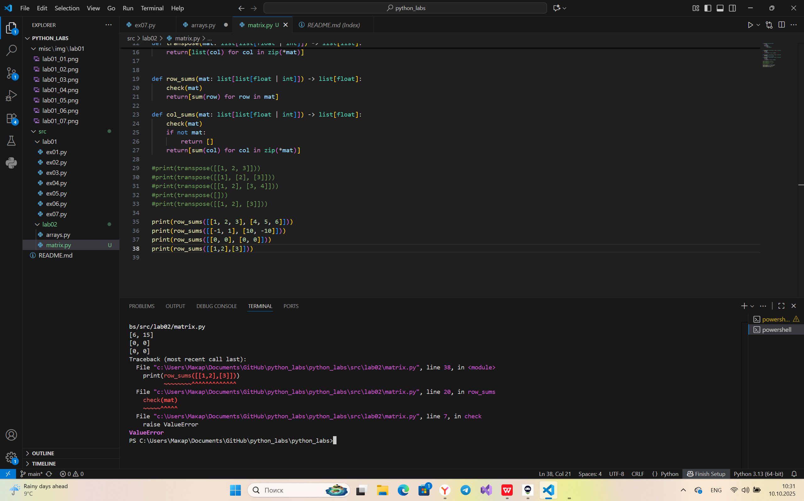
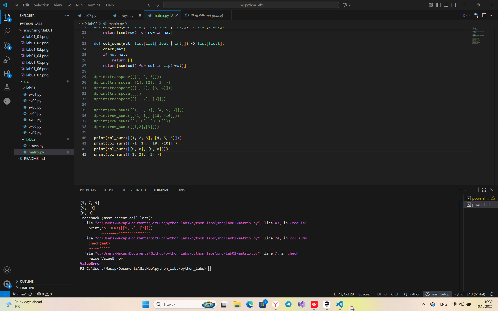


Задание C

```python
def format_record(rec: tuple[str, str, float]) -> str:
    if not isinstance(rec, tuple) or len(rec) != 3:
        raise ValueError("Ожидается кортеж из трёх элементов (fio, group, gpa)")

    fio, group, gpa = rec

    if not isinstance(fio, str):
        raise TypeError("ФИО должно быть строкой")
    
    if not isinstance(group, str):
        raise TypeError("Группа должна быть строкой")
    
    if not isinstance(gpa, (int, float)):
        raise TypeError("GPA должен быть числом")
    
    fio_clean=" ".join(fio.strip().split())

    parts=fio_clean.split()

    if len(parts)<2 or len(parts)>3:
        raise ValueError(f"Некорректное ФИО: '{fio}'")
    
    surname = parts[0].capitalize()

    initials= "".join(p[0].upper() + '.' for p in parts[1:])

    group_clean=group.strip()

    if not group_clean:
        raise ValueError("Группа не может быть пустой")
    
    gpa_str=f"{float(gpa):.2f}"

    return f"{surname} {initials}, гр. {group_clean}, GPA {gpa_str}"

print(format_record(("Иванов Иван Иванович", "BIVT-25", 4.6)))

print(format_record(("Петров Пётр", "IKBO-12", 5.0)))

print(format_record(("Петров Пётр Петрович", "IKBO-12", 5.0)))

print(format_record(("  сидорова  анна   сергеевна ", "ABB-01", 3.999)))
```
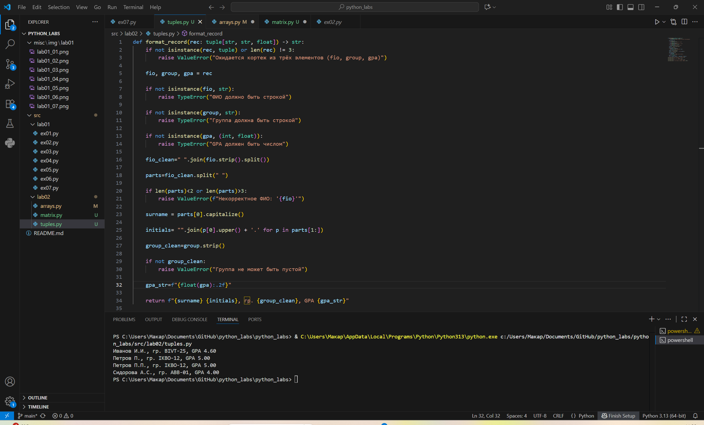


Лабараторная работа 3


Задание A
normalize
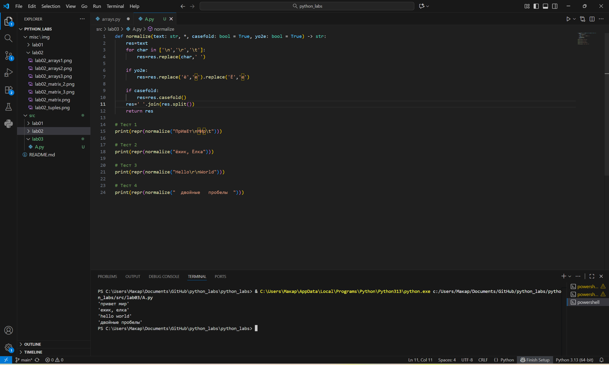
```python
def normalize(text: str, *, casefold: bool = True, yo2e: bool = True) -> str:
    res=text
    for char in ['\n','\r','\t']:
        res=res.replace(char,' ')
    
    if yo2e:
        res=res.replace('ё','е').replace('Ё','Е')
    
    if casefold:
        res=res.casefold()
    res=' '.join(res.split())


    return res

print(repr(normalize("ПрИвЕт\nМИр\t")))


print(repr(normalize("ёжик, Ёлка")))


print(repr(normalize("Hello\r\nWorld")))


print(repr(normalize("  двойные   пробелы  ")))
```

tokenize
```python
import re

def tokenize(text: str) -> list[str]:
    token = re.findall(r"[\w]+(?:-[\w]+)*", text)
    return token

print(tokenize("привет мир"))

 
print(tokenize("hello,world!!!"))

print(tokenize("по-настоящему круто"))

print(tokenize("2025 год"))

print(tokenize("emoji 😀 не слово"))
```


count_freq 


```python
def count_freq(tokens: list[str]) -> dict[str, int]:
    freq={}
    for token in tokens:
        if token in freq:
            freq[token]+=1
        else:
            freq[token]=1
    return freq

print(count_freq(["a","b","a","c","b","a"]))

print(count_freq(["bb","aa","bb","aa","cc"]))
def count_freq(tokens: list[str]) -> dict[str, int]:
    freq={}
    for token in tokens:
        if token in freq:
            freq[token]+=1
        else:
            freq[token]=1
    return freq

print(count_freq(["a","b","a","c","b","a"]))

print(count_freq(["bb","aa","bb","aa","cc"]))

```

top_n


```python
def top_n(freq: dict[str, int], n: int = 5) -> list[tuple[str, int]]:
    sort_it=sorted(freq.items(), key=lambda x: (-x[1],x[0]))
    return sort_it[:n]


print(top_n(count_freq(["a","b","a","c","b","a"]),2))
print(top_n(count_freq(["bb","aa","bb","aa","cc"]),2))

```


Задание B


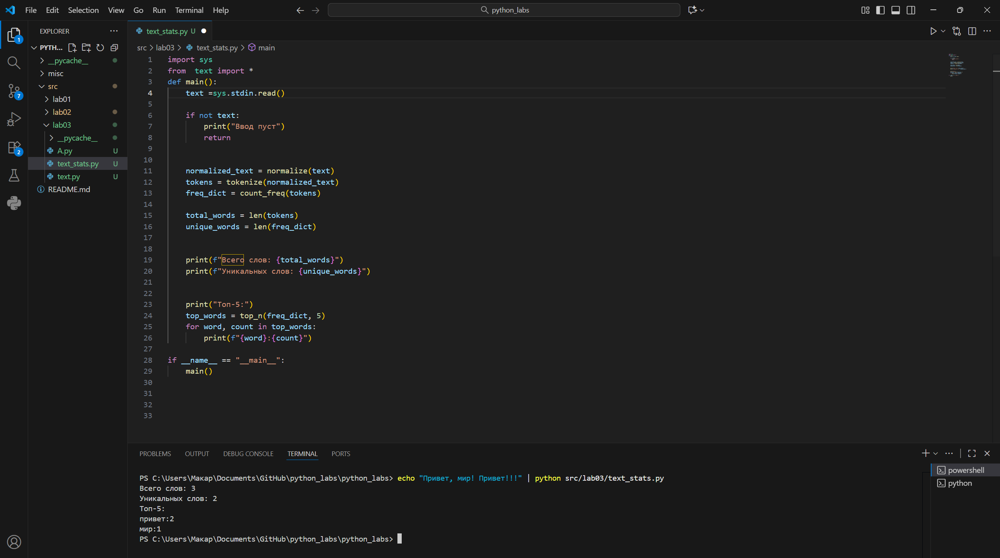

```python
import sys
from  text import *
def main():
    text =sys.stdin.read() 

    if not text:
        print("Ввод пуст")
        return
    
    
    normalized_text = normalize(text)
    tokens = tokenize(normalized_text)
    freq_dict = count_freq(tokens)
    
    total_words = len(tokens)
    unique_words = len(freq_dict)
    
   
    print(f"Всего слов: {total_words}")
    print(f"Уникальных слов: {unique_words}")
    
 
    print("Топ-5:")
    top_words = top_n(freq_dict, 5)
    for word, count in top_words:
        print(f"{word}:{count}")
 
if __name__ == "__main__":
    main()
```

